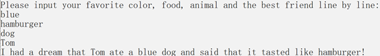
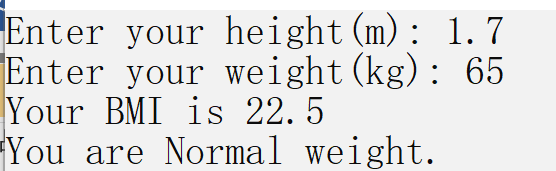

<title>上机作业2</title>
<link rel="stylesheet" href="../../css/style.css">
<h1>上机作业2</h1>

## 1. 组句游戏
**【问题描述】**
编程实现以下功能：要求用户从键盘逐行输入某个喜欢的颜色、喜欢的食物、喜欢的动物以及朋友的姓名。然后程序输出下面的内容。括号中的内容用用户输入来替换：  

I had a dream that (姓名) ate a (颜色) (动物) and said that it tasted like (食物)!

**【输入形式】**
颜色  
食物  
动物  
朋友姓名  
**【输出形式】**
I had a dream that 姓名  ate a 颜色  动物  and said that it tasted like  食物 !  
**【样例输入】**

```
blue  
hamburger  
dog  
Tom
```
  
**【样例输出】**

```
I had a dream that Tom ate a blue dog and said that it tasted like hamburger!
```

**【样例说明】**  
  
**【评分标准】**

```java
import java.util.Scanner;

public class Friend {
  public String color;
  public String food;
  public String animal;
  public String name;
  
  public Friend(String color, String food, String animal, String name) {
    this.color = color;
    this.food = food;
    this.animal = animal;
    this.name = name;
  }
  public void print() {
    System.out.printf("I had a dream that %s ate a %s %s and said that it tasted like %s!\n", name, color, animal, food);
  }
  public static void main(String[] args) {
    Scanner sc = new Scanner(System.in);
    System.out.println("Please input your favorite color, food, animal and the best friend line by line:");
    String color = sc.nextLine();
    String food = sc.nextLine();
    String animal = sc.nextLine();
    String name = sc.nextLine();
    Friend sentence = new Friend(color, food, animal, name);
    sentence.print();
    sc.close();
  }
}
```

## 2. 胖瘦程度计算
**【问题描述】**
BMI指数（身体质量指数，简称体质指数，Body Mass Index），是世界公认的一种评定胖瘦程度的分级方法。用体重（公斤）除以身高（米）的平方得到的数字：  
`（BMI）=体重（kg）÷身高^2（m）`  
成人的BMI数值范围：  
体重过轻(Underweight)：`BMI<18.5`  
正常体重(Normal weight)：`18.5<= BMI  <24`  
体重过重(Overweight)：`24<=  BMI < 27`  
肥胖(Obese)：`27<= BMI`  
编程实现以下功能：用户输入体重和身高，之后程序输出相应的BMI值及胖瘦程度。  
BMI值输出四舍五入之后保留一位小数的结果（结果如何保留一位小数大家自行网上查阅解决！！）。  
**【输入形式】**
身高  
体重  
**【输出形式】**
你的BMI值  
你的胖瘦程度  
**【样例输入】**
Enter your height(m): 1.7  
Enter your weight(kg): 65  
**【样例输出】**
Your BMI is 22.49134948096886  
You are Normal weight.  
**【样例说明】**  
  
**【评分标准】**

```java
import java.util.Scanner;
import java.lang.Math;

public class BMI {
  private double height;
  private double weight;
  private double bmi;
  private String result;
  public BMI(double height, double weight) {
    this.height = height;
    this.weight = weight;
  }
  public void Judgment() {
    bmi = weight / Math.pow(height, 2);
    if(bmi < 18.5) result = "Underweight";
    else if(bmi < 24) result = "Normal weight";
    else if(bmi < 27) result = "Overweight";
    else result = "Obese";
  }
  public void print() {
    System.out.printf("Your BMI is %.1f\n", bmi);
    System.out.printf("You are %s.\n", result);
  }
  public static void main(String[] args) {
    Scanner sc = new Scanner(System.in);
    double height;
    double weight;
    System.out.print("Enter your height(m): ");
    height = sc.nextDouble();
    System.out.print("Enter your weight(kg): ");
    weight = sc.nextDouble();
    BMI bmi = new BMI(height, weight);
    bmi.Judgment();
    bmi.print();
    sc.close();
  }
}
```

## 3. 使用循环编程
**【问题描述】**
你的程序要读入一系列正整数数据，输入-1表示输入结束，-1本身不是输入的数据。程序输出读到的数据中的奇数和偶数的个数。  
**【输入形式】**
一系列正整数，整数的范围是（0,100000）。如果输入-1则表示输入结束。  
**【输出形式】**
两个整数，第一个整数表示读入数据中的奇数的个数，第二个整数表示读入数据中的偶数的个数。两个整数之间以空格分隔。  
**【样例输入】**
9 3 4 2 5 7 －1  
**【样例输出】**
4 2  
**【样例说明】**  
**【评分标准】**

```java
import java.util.Scanner;

public class Stat {
  public static void main(String[] args) {
    Scanner sc = new Scanner(System.in);
    int i;
    int o = 0;
    int e = 0;
    while(true) {
      i = sc.nextInt();
      if(i == -1) break;
      else if(i %2 == 0) e++;
      else o++;
    }
    System.out.println(o+" "+e);
    sc.close();
  }
}
```

## 4. 基本编程-找出完数
**【问题描述】**
找到n~m之间（包括n和m，n和m<10000）的全部完数输出  
说明：一个数如果恰好等于除它本身外的因子之和，这个数就称为完数。例如6=1＋2＋3(6的因子是1,2,3)  
**【输入形式】**
两个整数，其中n<=m  
**【输出形式】**
n~m之间（包括n和m）的全部完数  
**【样例输入】**
1 1000  
**【样例输出】**
6 28 496   
**【样例输入】**
1 10000  
**【样例输出】**
6 28 496 8128 

```java
import java.util.Scanner;

public class PerNum {
  public static void main(String[] args) {
    Scanner sc = new Scanner(System.in);
    int n, m, sum;
    n = sc.nextInt();
    m = sc.nextInt();
    for(int i = n; i <= m; i++) {
      if(i < 6) continue;
      sum = 1;
      for(int j = 2; j <= (int)Math.sqrt(i); j++) {
        if(i % j == 0) {
          sum += j;
          if(j != i / j) sum += i / j;
        }
      }
      if(sum == i) System.out.print(i+" ");
    }
    System.out.println();
    sc.close();
  }
}
```