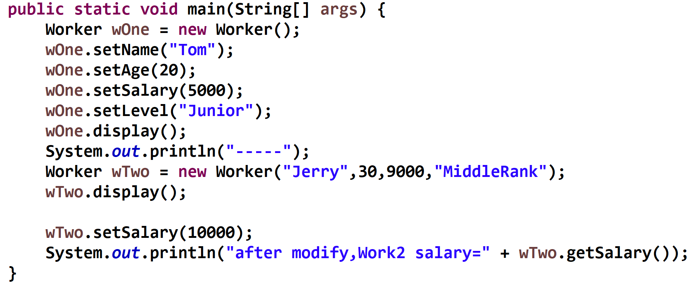
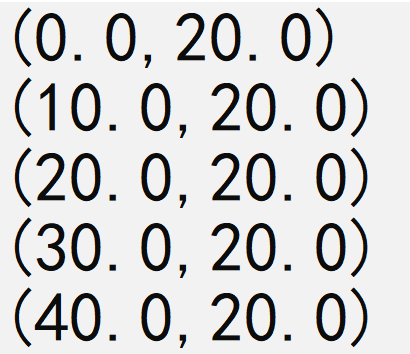

<h1>上机作业6</h1>

## 1. 构造方法和置取方法
设计一个公共类工人类Worker，属性有姓名、年龄、工资和级别，所有属性均为私有属性。  
设计一个方法display()显示工人的基本信息，至少设计两个构造方法，为所有属性添加置取方法。  
设计测试类Test，创建Worker类的对象，调用相应的置取方法，设置和获取工人的工资属性。  
程序运行结果如下：  
```
name=Tom  
age=20  
salary=5000.0  
level=Junior  
-----  
name=Jerry  
age=30  
salary=9000.0  
level=MiddleRank  
after modify,Work2 salary=10000.0  
```
main方法的代码如下：注意不要修改main类的代码，否则会扣分！！  

[Worker.zip](../../../_includes/lab/lab06/Worker/Worker.zip)  
主类名:Test









## 2. 点类
【问题描述】
MyPoint类表示二维坐标中的一个点，具有两个double类型属性：
    横坐标
    纵坐标
并具有一个构造方法(与类同名的方法)和两个普通方法：  
	1  构造方法：接收两个double型数据作为参数，分别设定为横坐标和纵坐标。  
	2 display()方法，无参数，输出坐标信息，格式形如"（10.0, 20.0）"。  
	3 getInfo()方法，无参数，返回字符串类型的坐标信息，格式形如"（10.0, 20.0）"。  
要求编程实现MyPoint类，使给定的Test类能正常运行，并实现指定的输出内容。  
```java
public class Test{
	public static void main(String[] args) 	{
		MyPoint point;
		for (int i=0;i<5;i++ ){
			point = new MyPoint(i*10.0,20.0);
			point.display();
		}
	}
}
```
【输入形式】  
【输出形式】
(0.0,20.0)  
(10.0,20.0)  
(20.0,20.0)  
(30.0,20.0)  
(40.0,20.0)  
【样例输入】  
【样例输出】  

【样例说明】  
【评分标准】  
[MyPoint.zip](../../../_includes/lab/lab06/MyPoint/MyPoint.zip)  
主类名:Test









## 3. 
[MyCircle.zip](../../../_includes/lab/lab06/MyCircle/MyCircle.zip)  
主类名:Test







