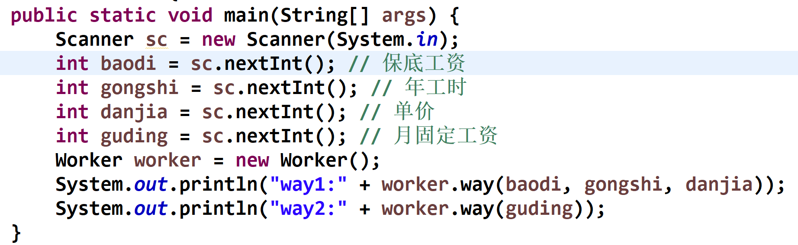
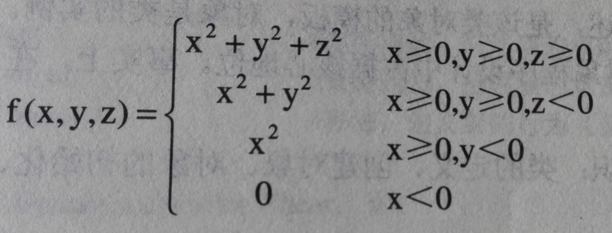
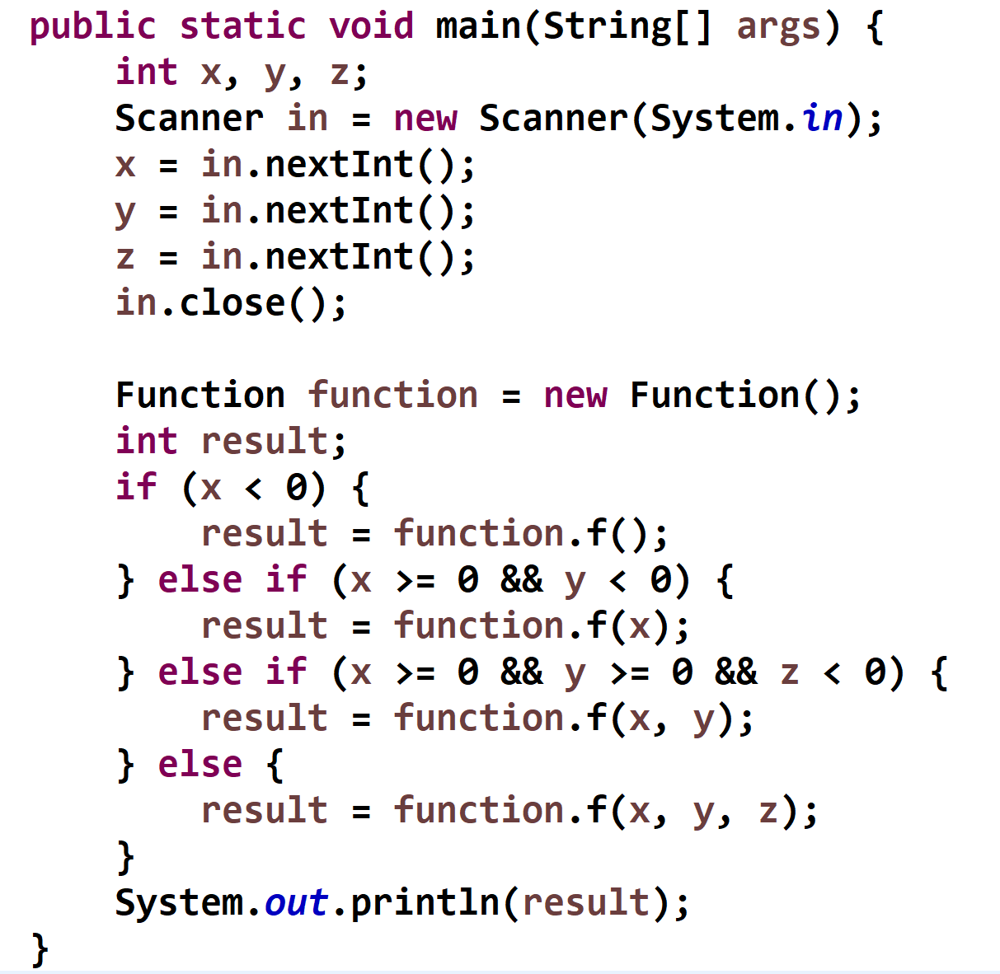
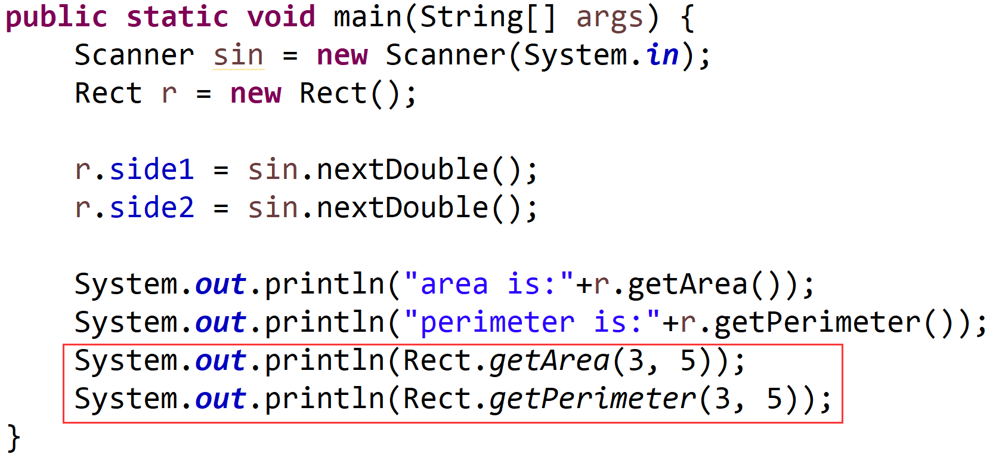
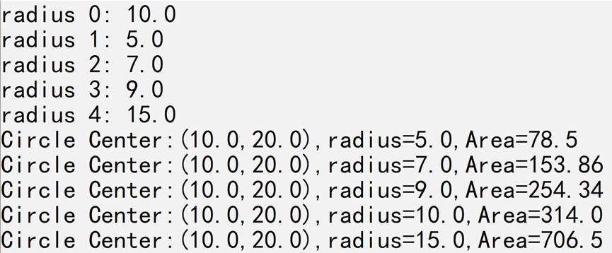
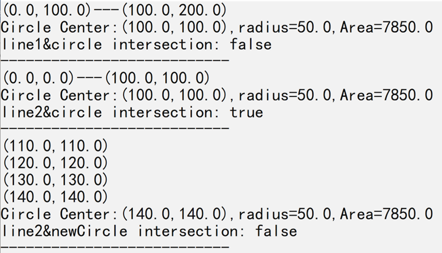

<h1>上机作业7</h1>

## 1. 方法的重载-计算工人工资
**【问题描述】**
定义Worker类，为该类添加计算工人年收入的**重载**方法。计算年收入有两个方法，第一个方法是保底工资+年工时\*单价；第二种方法是固定月工资*12.  
定义测试类，在main方法中分别使用两种方法计算工人的年收入。  
main方法的写法如下：注意不要修改main方法除了注释之外的代码，否则会扣分！中文注释在提交作业的时候一定要删除！  

要点提示：  
（1）第一个方法参数有：保底工资、年工时、单价，三个参数。  
（2）第二个方法参数有：月固定工资，一个参数  
（3）在测试类中输入保底工资、年工时、单价和月固定工资，输出对应的年收入。  
（4）保底工资、年工时、单价、月固定工资均为int类型  
输入提示为：<font color = "red">无</font>  
输入的数据值为：  
10000  
2000  
40  
6500  
输出结果为：  
way1:90000  
way2:78000  
若测试数据是：  
12000  
2000  
35  
7000  
则输出结果是：  
way1:82000  
way2:84000  
注意：必须使用方法的重载，否则会扣分！！！  
**【输入形式】**  
**【输出形式】**  
**【样例输入】**  
**【样例输出】**  
**【样例说明】**  
**【评分标准】**
[Worker.zip](../../../_includes/zip/lab/lab07/Worker.zip)  
主类名:Test









## 2. 方法重载
**【问题描述】**
已知分段函数公式如下图，  
  
定义Function类，该类中包含4个重载的f()方法，分别计算各个分段情况的值。  
定义测试类，在main方法中实现x，ｙ，ｚ值 的输入、条件的判断及结果的输出 。  
main方法的写法如下，注意，不要修改main的代码，否则会扣分：  
  
**【输入形式】**
三个整数  
**【输出形式】**
一个整数，表示分段函数计算结果  
**【样例输入】**
-1 5 7
**【样例输出】**
0  
**【样例输入】**
2 -2 7  
**【样例输出】**
4  
**【样例说明】**  
**【评分标准】**  
[Function.zip](../../../_includes/zip/lab/lab07/Function.zip)  
主类名:Test









## 3. 类的基本定义和使用+static
在以前“类与对象的作业”定义矩形类Rect的基础上，增加两个静态方法：  
`public static double getArea(double x,double y)`  
`public static double getPerimeter(double x,double y)`。  
这两个方法根据接收的参数值，分别计算矩形的面积和周长。  
main方法的代码如下，注意，不要修改main方法的代码，否则会扣分：  
  
[Rect.zip](../../../_includes/zip/lab/lab07/Rect.zip)  
主类名:Test









## 4. 同心圆
**【问题描述】**
ConcentricCircles类表示一组同心圆，具有三个属性：  
同心圆圆心，类型MyPoint （类定义同前题）  
同心圆数组，类型MyCircle数组（类定义同前题）  
同心圆个数，类型int  
并具有一个构造方法(与类同名的方法)和两个普通方法：  
1  构造方法：接收两个参数（MyPoint对象和size型数据），分别设定为圆心和同心圆个数，并定义同心圆数组。  
2 createCircles()方法：接收一个整型数组作为参数，创建size个同心圆 。   
3 sort()方法：对同心圆数组按照面积从小到大排序。  
4 display()方法：显示所有圆的信息。  
要求编程实现MyCircle类，使给定的Test类能正常运行，并实现指定的输出内容。 

```java
public class Test {
  public static void main(String[] args) {
    int size = 5;
    double[] radius = {10.0,5.0,7.0,9.0,15.0};
    MyPoint point;
    point = new MyPoint(10.0,20.0);
    for (int i=0;i<size;i++ ){
      System.out.println("radius "+i+": "+radius[i]);
    }
    ConcentricCircles cc = new ConcentricCircles(size, point);
    cc.createCircles(radius);
    cc.sort();
    cc.display();
  }
}
```

**【输入形式】**  
**【输出形式】**  
radius 0: 10.0  
radius 1: 5.0  
radius 2: 7.0  
radius 3: 9.0  
radius 4: 15.0  
Circle Center:(10.0,20.0),radius=5.0,Area=78.5  
Circle Center:(10.0,20.0),radius=7.0,Area=153.86  
Circle Center:(10.0,20.0),radius=9.0,Area=254.34  
Circle Center:(10.0,20.0),radius=10.0,Area=314.0  
Circle Center:(10.0,20.0),radius=15.0,Area=706.5  
**【样例输入】**  
**【样例输出】**  
  
**【样例说明】**  
**【评分标准】**  
[ConcentricCircles.zip](../../../_includes/zip/lab/lab07/ConcentricCircles.zip)  
主类名:Test  

















## 5. 线圆相交
**【问题描述】**  
---点类3-P128  
MyPoint类表示二维平面中的一个点，具有两个double类型属性：  
横坐标  
纵坐标  
并具有一个构造方法(与类同名的方法)和以下普通方法：  
1  构造方法：接收两个double型数据作为参数，分别设定为横坐标和纵坐标。  
2 display()方法，无参数，输出坐标信息，格式形如“(10.0,20.0)”。  
3 getInfo()方法，无参数，返回字符串类型的坐标信息，格式形如"(10.0,20.0)"。  
4所有属性的置取方法。  
5 move ()方法，接收两个double型数据作为参数，分别将横坐标和纵坐标移动相应的距离。  
6 getDistance()方法，接收一个MyPoint类型对象作为参数，计算并返回double类型的两点间距离值。   
---线段类2-P123  
LineSeg类表示二维平面中的一个线段，具有两个MyPoint类型属性：  
端点1  
端点2  
并具有一个构造方法(与类同名的方法)和以下普通方法：  
1  构造方法：接收两个MyPoint类型对象作为参数，分别设定为两个端点。  
2 intersection()方法，接收一个LineSeg类型对象作为参数，判断两个线段是否相交并返回true或false。  
3 display()方法，无参数，输出线段信息，格式形如“(10.0,20.0)---(10.0,30.0)”。  
4 所有属性的置取方法。  
5 getDistance()方法，接收一个MyPoint类型对象作为参数，计算并返回double类型的点线间距离值。   
---圆类3-P128  
MyCircle类表示二维坐标中的一个圆，具有两个属性：  
圆心，MyPoint类型  
圆半径，double类型  
并具有一个构造方法(与类同名的方法)和以下普通方法：  
1  构造方法：接收一个MyPoint类型对象和一个double型数据作为参数，分别设定为圆心和圆半径。  
2 getArea()方法，无参数，计算并返回圆面积。  
3 display()方法，无参数，输出圆心坐标和圆面积，格式形如"Circle Center:(10.0,20.0),radius=10.0,Area=314.0"。  
4 intersection()方法，接收一个LineSeg类型对象作为参数，判断线段和圆是否相交并返回true或false。  
5 move ()方法，接收两个double型数据作为参数，分别将圆心横坐标和纵坐标移动相应的距离。  
6 所有属性的置取方法。  
要求编程实现上面的类，使给定的Test类能正常运行，首先判断给定的线段和圆是否相交，如相交则重复移动圆move(10,10），直到不相交为止，并实现相应的输出内容。  

```java
public class Test {
  public static void main(String[] args) {
    double r = 50;
    MyPoint center = new MyPoint(100,100);
    MyCircle circle = new MyCircle(center, r);
    LineSeg line1 = new LineSeg(new MyPoint(0,100), new MyPoint(100,200));
    LineSeg line2 = new LineSeg(new MyPoint(0,0), new MyPoint(100,100));             
    line1.display();
    circle.display();
    System.out.println("line1&circle intersection: "+circle.intersection(line1));             
    System.out.println("---------------------------");
    line2.display();
    circle.display();
    System.out.println("line2&circle intersection: "+circle.intersection(line2));
    System.out.println("---------------------------");
    while(circle.intersection(line2)) {
      circle.move(10,10);
      circle.getCenter().display();
    }
    circle.display();
    System.out.println("line2&newCircle intersection: "+circle.intersection(line2));      
    System.out.println("---------------------------");
  }
}
```

**【输入形式】**  
**【输出形式】**  
```
(0.0,100.0)---(100.0,200.0)  
Circle Center:(100.0,100.0),radius=50.0,Area=7850.0  
line1&circle intersection: false  
---------------------------  
(0.0,0.0)---(100.0,100.0)  
Circle Center:(100.0,100.0),radius=50.0,Area=7850.0  
line2&circle intersection: true  
---------------------------  
(110.0,110.0)  
(120.0,120.0)  
(130.0,130.0)  
(140.0,140.0)  
Circle Center:(140.0,140.0),radius=50.0,Area=7850.0  
line2&newCircle intersection: false  
---------------------------  
```
**【样例输入】**  
**【样例输出】**  
  
**【样例说明】**  
**【评分标准】**  
[LineCircleIntersect.zip](../../../_includes/zip/lab/lab07/LineCircleIntersect.zip)  
主类名:Test  















