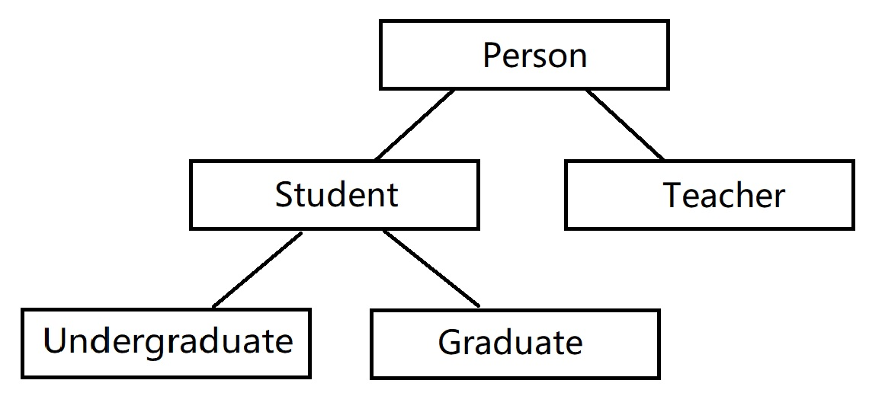
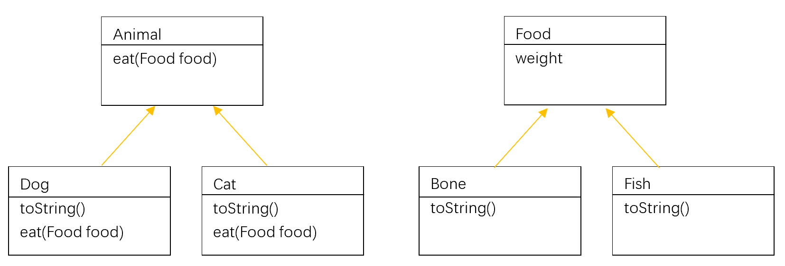
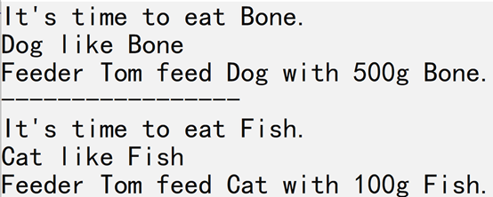

<h1>上机作业8</h1>

## 1. 多态编程
**【问题描述】**  
类的继承关系如图所示。  
   
其中：  
Person类具有String属性name（姓名）和display()方法；  
Teacher类继承Person类，并具有String属性professionalTitle（职称）和display()方法；  
Student类继承Person类，并具有int属性studentNumber（学号）和display()方法；  
Graduate类和Undergraduate类都继承Student类，并具有各自的display()方法,  
    Graduate类具有String属性major（专业），  
    Undergraduate类具有int属性grade(年级)。  
所有类都应该具有合适的构造方法和按照一定格式（见输出样例）输出所有属性值display()方法。  
要求编程实现这些类，使给定的Test类能正常运行，并实现指定的输出内容。
Test类代码如下：

```java
public class Test
{
    public static void main(String[] args)
    {
        Person[] people = new Person[5];
        people[0] = new Person("Tom");
        people[1] = new Teacher("Kevin","professor");
        people[2] = new Student("Jerry",21);
        people[3] = new Undergraduate("John",22,3);
        people[4] = new Graduate("Mary",23,"computer");

        for (Person p: people)
        {
            p.display();
            System.out.println(">>>");
        }
    }
}
```

**【输入形式】**  
**【输出形式】**  
**【样例输入】**  
**【样例输出】**

```
Name: Tom
>>>
Name: Kevin
Professional Title: professor
>>>
Name: Jerry
StudentNumber: 21
>>>
Name: John
StudentNumber: 22
Grade: 3
>>>
Name: Mary
StudentNumber: 23
Major: computer
>>>
```

**【样例说明】**  
**【评分标准】**  
[Person.zip](../../../_includes/zip/lab/lab08/Person.zip)  
主类名:Test  

























## 2. 多态编程2
**【问题描述】**  
    
类的继承关系如图所示：  
其中：
Animal类具有eat(Food food)方法,功能是输出形如"It's time to eat Fish."的语句，其中“Fish”是food对象的类名。  
Dog类需要重写Object类的toString()方法，返回类名字符 串；还要重写Animal类的eat()方法，增加输出形如“Dog like Bone”语句的功能，其中“Bone”是food对象的类名。  
Cat类与Dog类相似；  
Food类具有weight属性，和适当的构造方法和置取方法；  
Bone类和Fish类都需要重写Object类的toString()方法，返回类名字符串；  
要求编程实现这些类，使给定的Test类能正常运行，并实现指定的输出内容（Feeder类已给出）。  

```
public class Test{
    public static void main(String[] args) {
        Feeder fd = new Feeder("Tom");
        Dog dog = new Dog();
        Bone bone = new Bone(500);
        fd.feed(dog, bone);
        System.out.println("-----------------");
        fd.feed(new Cat(), new Fish(100));
    }
}
class Feeder {
    private String name;
    public Feeder(String name) {
        this.name = name;
    }   
    public void feed(Animal a, Food f) {
        a.eat(f);
        System.out.println("Feeder "+name+" feed "+a+ " with "+f.getWeight()+"g "+f+".");
    }   
}
```

**【输入形式】**  
**【输出形式】**
```
It's time to eat Bone.
Dog like Bone
Feeder Tom feed Dog with 500g Bone.
-----------------
It's time to eat Fish.
Cat like Fish
Feeder Tom feed Cat with 100g Fish.
```

**【样例输入】**  
**【样例输出】**
 
**【样例说明】**  
**【评分标准】**  
[Animal.zip](../../../_includes/zip/lab/lab08/Animal.zip)  
主类名:Test  



























